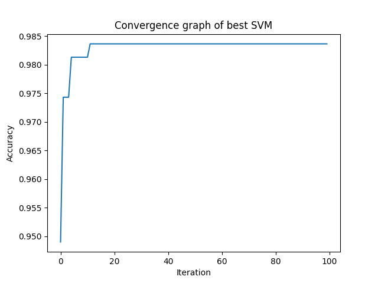

# Parameter-Optimization-of-SVM

Table 1. Comparative performance of Optimised SVM with different samples

|Sample| Kernel   |   c | gamma   |   degree |   Accuracy |
|-----:|:---------|----:|:--------|---------:|-----------:|
|1     | rbf      |   7 | scale   |        1 |   0.976333 |
|2     | poly     |   2 | auto    |        5 |   0.978    |
|3     | rbf      |   4 | scale   |        4 |   0.981333 |
|4     | rbf      |   7 | scale   |        4 |   0.983333 |
|5     | rbf      |   6 | auto    |        3 |   0.981333 |
|6     | poly     |   3 | scale   |        5 |   0.980333 |
|7     | poly     |   6 | auto    |        5 |   0.982333 |
|8     | rbf      |   7 | scale   |        1 |   0.983667 |
|9     | rbf      |   7 | auto    |        3 |   0.980333 |
|10    | rbf      |   7 | auto    |        5 |   0.979333 |

## Result
The best parameters of SVC for the given dataset are:
- Kernel : rbf
- C : 7
- Gamma : scale
- Degree : NA

The above parameter gave a maximum accuracy of 0.983667.
